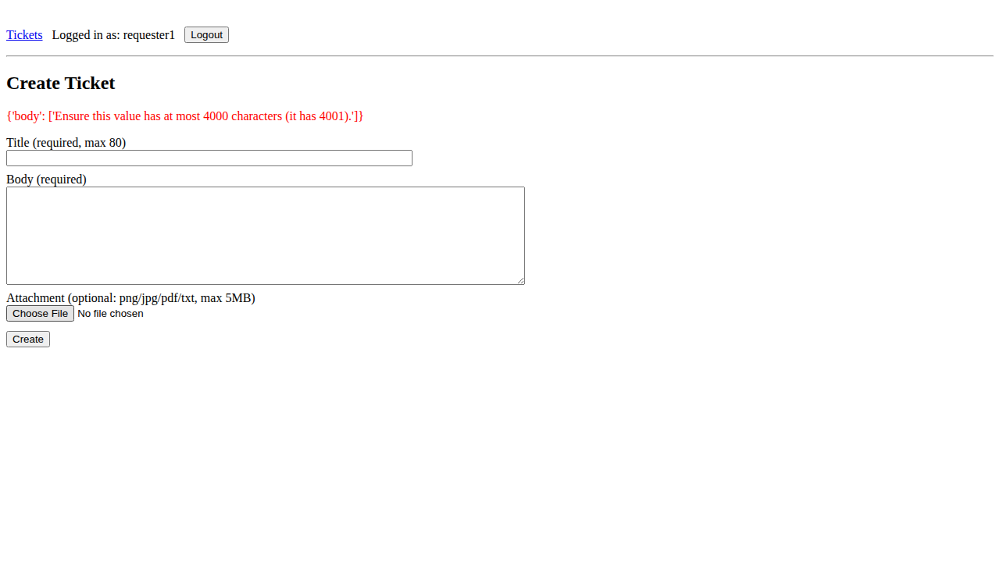
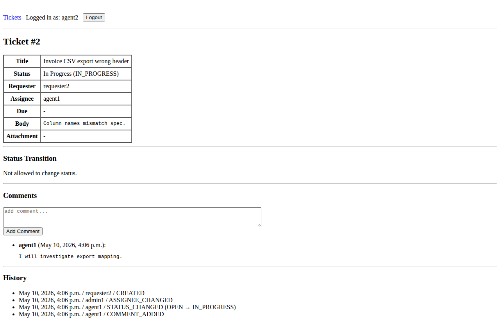

# BtoB チケット管理システム：QA技術ポートフォリオ
[](https://github.com/nani9ashi/qa-portfolio-ticket-system/actions/workflows/ci.yml)

## このポートフォリオの位置付け

本ポートフォリオは **QAエンジニアの基礎技術習得**（CI・E2E自動化・JSTQB準拠のドキュメンテーション）を目的として作成したものです。
その後、**戦略的な品質保証・関係者連携・AIプロダクトの品質設計**の観点を深めるために、追加で
[AI学習レコメンドポートフォリオ](https://github.com/nani9ashi/qa-portfolio-ai-recommender)
を構築しています。
2点を「学習の深化の軌跡」としてご覧いただければ幸いです。

## プロジェクト概要

BtoB業務を想定した **複雑な RBAC と状態遷移を持つチケット管理アプリ** を対象に、JSTQB 準拠のテストプロセスと E2E 自動化（CI 品質ゲート）を一人称で完遂した統合ポートフォリオです。SUT の詳細は [app/README](./app/README.md) を参照。

## 技術スタック

本ポートフォリオの技術スタックの正本です。app/README §2 と qa/README はここを参照します。

| カテゴリ | 技術・ツール | 用途 |
| --- | --- | --- |
| **Language** | Python 3.12 | アプリケーションおよびテストコード記述 |
| **Framework** | Django 6.0 | Webアプリケーション構築 (MVP) |
| **Test Automation** | Playwright | E2Eテスト自動化、スクリーンショット取得 |
| **Test Runner** | pytest | テスト実行管理 |
| **CI** | GitHub Actions | E2Eテストの自動実行と証跡保存 |
| **Environment** | venv / pip | 仮想環境およびパッケージ管理 |

## テスト対象システム (SUT: System Under Test)

ロール認可（[§5](./app/README.md#5-ロールと権限仕様rbac)）／状態遷移（[§6](./app/README.md#6-ステータス遷移仕様state-machine)）／意図的欠陥スイッチ（[§9](./app/README.md#9-テスト用の意図的欠陥bug-switch)）を備えた SUT。詳細は [app/README](./app/README.md)。

## ディレクトリ構成 (Monorepo)
本リポジトリは、開発（Dev）と品質保証（QA）を統合管理しています。

```text
root/
├── .github/workflows/  # CI設定 (GitHub Actionsによる自動テスト実行)
├── app/                # アプリケーション本体 (Django)
└── qa/                 # QA統合成果物 (JSTQBプロセス準拠)
```

## 主要ドキュメントへのリンク
- **アプリケーション仕様**: [app/README](./app/README.md)  
  - ロール権限、状態遷移、入力検証、意図的欠陥スイッチの解説
- **テスト概要・自動化方針**: [qa/README](./qa/README.md)  
  - テスト計画から完了報告までの一連のQAプロセス資料、および自動テストの実装詳細

## QA戦略: 手動と自動のハイブリッド構成 (Hybrid Strategy)

本プロジェクトでは、「**人間が深く見るべき領域**」と「**機械が繰り返すべき領域**」を明確に分離し、最大の品質効率を追求しています。

| 特性 | 手動テスト (Manual Testing) | 自動テスト (Automated Testing) |
| :--- | :--- | :--- |
| **目的** | 仕様の深掘り、探索的テスト、ユーザビリティ確認 | 回帰テスト（リグレッション）、CI品質ゲート |
| **対象** | 複雑なビジネスロジック、エッジケース、異常系 | 正常系（Happy Path）、基本的な権限確認 |
| **成果物** | [JSTQB準拠ドキュメント一式](./qa/README.md)  | [Playwrightコード](/qa/automation/tests/) |
| **規模** | **テストケース数: 46件** | **シナリオ数: 4件** |

---

## 主な取り組み (Highlights)

### 1. JSTQB準拠のテストプロセス（手動）
Vモデルを意識し、要求分析から完了報告までを一貫してドキュメント化しています。
- **テスト技法**: 同値分割法、境界値分析を用いた効率的なケース設計。
- **欠陥管理**: バグの発見から修正確認までをレポート化し、開発側へのフィードバックを実施。

### 2. E2Eテストの完全自動化（自動・4シナリオ）
手動テストで安定稼働を確認した「クリティカルパス」と、QAリスク観点（IDOR／境界値／RBAC）の代表シナリオをコード化し、リグレッションを自動検知します。
- **シナリオ構成**: ハッピーパス（Auto-01）／IDOR回帰（Auto-02、DEFECT-001由来）／本文境界値（Auto-03）／非担当Agentの認可（Auto-04）。詳細は [60_test_completion_report.md §11](./qa/docs/60_test_completion_report.md#11-付記テスト自動化の実施結果-automated-test-summary)。
- **堅牢な実装 (Robust Automation)**: `name`属性などの不変属性を用いたロケータ戦略。共通fixture（`qa/automation/conftest.py`）でログイン・BASE_URL・証跡保存を集約。
- **Framework**: Playwright + pytest を使用。`BASE_URL` 環境変数で接続先切替可。
- **CI**: GitHub Actionsにより、PR作成時に4シナリオすべてを自動実行。

#### 自動テストが捕捉した代表的な挙動

以下は CI Artifacts から取得した実際のスクリーンショットです。

**Auto-03 — DEFECT-002 修正後の本文バリデーション**



本文4001文字での作成試行に対し、`Ensure this value has at most 4000 characters (it has 4001).` を表示して拒否。本シナリオの実装中に **[DEFECT-002](./qa/defects/reports/DEFECT-002.md)（body max_length 未実装）** を検出・修正・回帰確認した。

**Auto-04 — 非担当Agentの認可UI抑止**



agent2 が非担当チケット（agent1割当）を開くと、Status Transition は「Not allowed to change status.」のみで `<select>` が描画されない。「**見えるが操作できない**」というRBACの正常な挙動を確認。

### 3. シフトレフトを意識した構成
開発コード（`app`）とテストコード（`qa`）を同一リポジトリで管理することで、開発サイクルの中に品質保証プロセスを組み込んでいます。

## 本ポートフォリオの範囲

テスト計画における「説明責任」を意識し、**意図的にスコープ外とした項目** を以下に明示します。やらない理由を残すこと自体も品質活動の一部だと考えています。

- **単体テスト（Unit Test）**：本MVPでは E2E（システムテスト）に集約し、`models.py` 等の単体テストは未整備としています。SUT が小規模でビジネスロジックが画面側に集約されること、および学習段階としては E2E で得られる手戻りシグナルを優先したいことが理由です。今後の拡張で `pytest` ベースの単体テスト追加を Backlog としています。
- **専門的な脆弱性診断（侵入テスト等）**：QA 活動対象外。簡易的な脆弱性のチェックを、意図的欠陥（IDOR）の起票→修正→回帰のフローで表現しています。

未カバー要件の扱いについては、[要件とテストのトレーサビリティ](./qa/docs/70_requirements_test_traceability.md) で A（追加してカバー）／ B（スコープ外）／ C（要件を修正・明確化）に分類して管理しています。

## 動作確認

CIで `push` / `pull_request` 時に4シナリオを自動実行（上部バッジ参照）。手元で動かす場合の手順は **[SETUP.md](./SETUP.md)** に集約しています。

## 作者

**仁後慎太郎**

「現場で本当に使えるプロダクトをどう作るか」に関心を持って学習を続けている社会人です。JSTQB Foundation Level 保有。塾講師や警備員としての経験と、哲学を専攻したバックグラウンドを持ち、**ユーザーや現場目線で仮説を立て、関係者と対話しながら品質を作り込む**スタイルを模索しています。正確性や信頼性が求められる BtoB 領域においても、**観察力と論理性**で価値を生み出していきたいと考えています。

## ライセンス
本プロジェクトは MITライセンス に基づいて公開されています。利用条件については [LICENSE](LICENSE) ファイルをご参照ください。