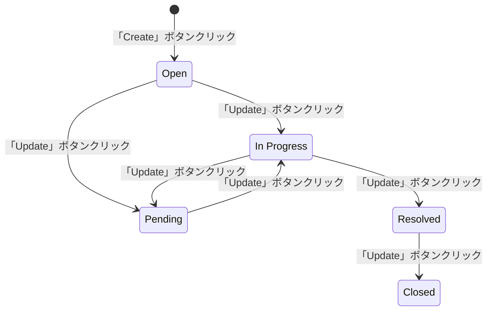

# テスト設計 - チケット管理アプリ

- 文書ID：TD-TICKET-001
- 版：v1.2
- ステータス：Approved
- 最終更新日：2026-03-11
- 作成者：仁後慎太郎
- 対象：チケット管理アプリ（Web, Django + SQLite）
- 関連：
  - [テスト計画書](10_test_plan.md)
  - [テスト条件](20_test_conditions.md)
  - [テストケース](../testcases/testcases.csv)

## 1. 目的

テストベースから、優先度付きのテスト条件を導き、代表的なテストケースへ落とし込む設計方針を示す。

## 2. テスト技法（採用）

- 同値分割・境界値分析：タイトル/本文/期限/添付サイズ
- 状態遷移テスト：ステータス遷移の許可/禁止
- デシジョンテーブル：ロール×操作（参照/更新/割当）
- 探索的テスト：チャーターに基づき追加のテスト条件を抽出

## 3. モデル

### 3.1 状態遷移モデル（State Transition）

※ Create は Admin または Requester が実行可能
※ Update は Admin または担当Agent が実行可能

### 3.2 権限マトリクス（Decision Table）
| 操作 | 依頼者 | 担当者 | 管理者 |
| 区分 | 項目 | 値 | 1 | 2 | 3 | 4 | 5 |
|---|---|---|---|---|---|---|---|
| 有効/無効 |  |  | [x] | [x] | [x] | [x] | [x] |
|  |  |  | 1 | 2 | 3 | 4 | 5 |
| 条件 | 現在ステータスがClosedである |  | Y | N | N | N | N |
|  | ロール（Admin） | Admin |  | Y | N | N | N |
|  |  | Agent |  | N | Y | Y | N |
|  |  | Requester |  | N | N | N | Y |
|  | チケット担当が自分である |  |  |  | Y | N |  |
| 動作 | ステータス変更を許可 |  |  | X | X |  |  |
|  | ステータス変更を禁止 |  | X |  |  | X | X |

## 4. カバレッジアイテム（Coverage Items）

本ポートフォリオでは、少なくとも以下をカバレッジアイテムとして扱う。

- ロール：依頼者 / 担当者 / 管理者
- ステータス：Open / In Progress / Pending / Resolved / Closed
- 遷移：許可遷移（○）と禁止遷移（×）
- 入力制約：必須、文字数境界、期限、添付（サイズ/形式）
- 一覧・検索：キーワード、状態フィルタ、ソート

## 5. テストチャーター（Test Charters）

### チャーター1（30分）
目的：権限と直接アクセスの抜けを見つける

範囲：一覧/詳細/更新（URL直叩き、ID変更、ボタン表示）

着眼点：参照・更新・割当がロールどおりか、エラー表示の分かりやすさ

### チャーター2（30分）
目的：状態遷移と履歴の破綻を見つける

範囲：遷移操作、コメント、履歴表示

着眼点：禁止遷移、二重クリック、戻る/更新、履歴の時系列

## 6. テストデータ要件（Test Data Requirements）

- アカウント：依頼者/担当者/管理者を各1つ以上
- チケット：各ステータスのチケットを数件ずつ（検索用にカテゴリや期限を変える）
- 期限：未来日/当日/過去日
- 添付：小サイズ/上限超過、許可形式/不許可形式

## 7. テスト環境要件（Test Environment Requirements）

- ローカル起動：Docker Compose（再現性確保）
- ブラウザ：Chrome / Edge（任意でFirefox）
- 証跡：スクリーンショット、必要に応じて短い録画

## 8.自動化対象の選定基準

以下の条件を満たすケースをPlaywrightによる自動化対象とする。

- 繰り返し実行が必要なスモークテスト。
- 複数のロール（Admin/Agent/Requester）を跨ぐ権限確認。
- データ投入から確認までの一連のハッピーパス。