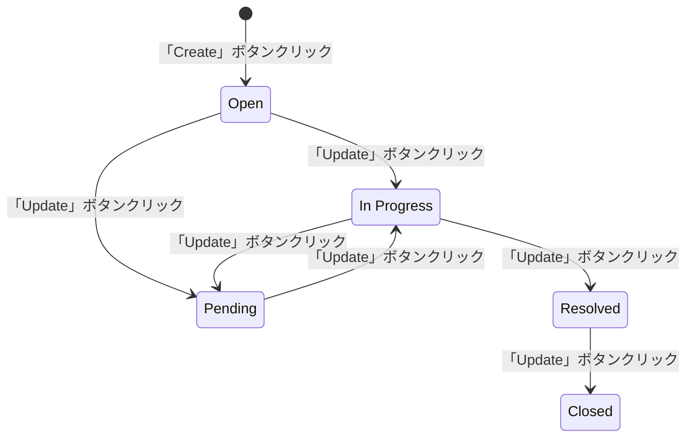

# テスト設計 - チケット管理アプリ

- 文書ID：TD-TICKET-001
- 版：v1.7
- ステータス：Approved
- 最終更新日：2026-07-23
- 作成者：仁後慎太郎
- 対象：チケット管理アプリ（Web, Django + SQLite）
- 関連：
  - [テスト計画書](10_test_plan.md)
  - [テスト条件](20_test_conditions.md)
  - [テストケース](../testcases/testcases.csv)

## 1. 目的

テストベースから、優先度付きのテスト条件を導き、代表的なテストケースへ落とし込む設計方針を示す。

## 2. テスト技法（採用）

- 同値分割・境界値分析：タイトル/本文/期限/添付サイズ
- 状態遷移テスト：ステータス遷移の許可/禁止
- デシジョンテーブル：ロール×操作（参照/更新/割当）

## 3. モデル

### 3.1 状態遷移モデル（State Transition）

```mermaid
stateDiagram-v2
    state "In Progress" as InProgress

    [*] --> Open : 「Create」ボタンクリック

    Open --> InProgress : 「Update」ボタンクリック
    Open --> Pending : 「Update」ボタンクリック

    InProgress --> Resolved : 「Update」ボタンクリック
    InProgress --> Pending : 「Update」ボタンクリック

    Pending --> InProgress : 「Update」ボタンクリック

    Resolved --> Closed : 「Update」ボタンクリック
```
- Create は Requester が実行可能（Admin作成は Should 要件として Backlog 管理）
- Update（ステータス変更）は Admin または担当Agent が実行可能
- 本ポートフォリオでは **0-switch（単一遷移）カバレッジ** を採用する。1-switch 以上（2連続遷移）は組合せ爆発を考慮しスコープ外とした。Closed は事実上の終了状態として扱う。
- **本状態遷移モデル（許可/禁止エッジ）と §3.2 のデシジョンテーブル R1-R6 は、単体層（pytest：`can_transition_to` の 5×5 全マトリクス25本＋`check_status_change`／`can_update_status`）と runn API 層（API-B：valid_edges / invalid_transitions / role_constraints）の両層で検証している。手動テストは 0-switch を採用するが、単体層は全遷移判定（許可/禁止の全組合せ）を網羅する。層の判断は [80 テスト層戦略](80_test_layer_strategy.md)。**

### 3.2 権限マトリクス（Decision Table — ステータス変更操作の認可）

本表は **「ステータス変更操作を実行する認可があるか」** を表す。**遷移先の妥当性**（Open→Closed 禁止 等）は §3.1 の状態遷移モデル側で定義されており、本表の「許可」と AND 条件を満たす場合のみ実際に状態が更新される（実装上は `views.ticket_change_status` で両者を直列にチェック）。

採用記法：混合指定表（Mixed-entry table）。多値条件は1行で表現し、Y/N を3行に展開しない。

| 条件・動作 / ルール No. | R1 | R2 | R3 | R4 | R5 | R6 |
|---|---|---|---|---|---|---|
| **C1**: 現在ステータス = Closed | Y | N | N | N | N | N |
| **C2**: ロール | − | Admin | Agent | Agent | Agent | Requester |
| **C3**: 担当者が割当済 | − | − | Y | Y | N | − |
| **C4**: 担当者 = 自分（ログインユーザ） | − | − | Y | N | − | − |
| **A1**: ステータス変更操作を許可 | − | X | X | − | − | − |
| **A2**: ステータス変更操作を禁止 | X | − | − | X | X | X |

凡例：
- **Y / N**：条件を満たす／満たさない
- **−**：don't care（他条件で結論が確定しているため値を問わない）
- **X**：当該動作が選択される
- 列ごとに動作は **A1 と A2 のいずれか一方のみ** が X となる（排他）

ルールの読み方（要点）：
- **R1**：Closed は他条件を問わず変更禁止（Closed は終了状態）
- **R2**：Admin は常に許可（Closed 以外）
- **R3**：Agent は「担当が自分」のときのみ許可
- **R4**：Agent でも「担当が他人」なら禁止
- **R5**：Agent でも「担当未割当」なら禁止（要件 RQ-034 / TCND-041 に対応）
- **R6**：Requester は常に禁止

要件・テストとの対応（一次ソースは [トレーサビリティ70](70_requirements_test_traceability.md)）：
| ルール | 主な対応要件 | 主な対応TC |
|---|---|---|
| R1 | RQ-041 | TC-028 |
| R2 | RQ-032（一部） | TC-021 / TC-022 / TC-025 / TC-027 / TC-030 |
| R3 | RQ-029 | 手動TCはBacklog。単体（`test_assigned_agent_can_update_status` 等）／API-B（`role_constraints`）でカバー済み |
| R4 | RQ-029 | TC-007 |
| R5 | RQ-034 | TC-008 |
| R6 | RQ-026 | TC-004 / TC-005 |

### 3.3 同値分割・境界値分析（Boundary Value Analysis）

各入力項目について、無効下限／有効下限／有効上限／無効上限の4点を整理する（各境界とその外側の隣接値を取る **2値境界値分析（2-value BVA・ISTQB FL準拠）**）。

| 項目 | 無効下限 | 有効下限 | 有効上限 | 無効上限 | 主な対応TC |
|---|---|---|---|---|---|
| title（必須・最大80文字） | 0文字（空） | 1文字 | 80文字 | 81文字 | TC-033 / TC-034 / TC-035 |
| body（必須・最大4000文字） | 0文字（空） | 1文字 | 4000文字 | 4001文字 | TC-033（必須）／ TC-045 / TC-046 |
| due_date（任意・過去日不可） | 昨日（過去） | 当日 | （上限なし） | （該当なし） | TC-036 |
| 添付サイズ（任意・最大5MB） | （該当なし） | 1B | 5MB（5,242,880B） | 5MB+1B | TC-038 |
| 添付拡張子 | 不許可拡張子 | 許可拡張子（png/jpg/jpeg/pdf/txt） | 同左 | 同左以外 | TC-039 |

注：
- title／body の「無効下限=0文字」は **必須エラー（同値クラス：未入力）** として TC-033 で集約検証している。
- due_date の上限は仕様上未定義（運用上は任意）。
- 添付サイズの「無効下限」は実装上発生し得ない（0Bファイル＝アップロード不成立）ため対象外とした。
- **title/body の4点境界は runn API 層（API-C：title_body_boundary）、due_date の過去日/不正値は API-C（due_date）で検証している。添付の境界は API テスト対象外（E2E/手動に残置）。**

## 4. カバレッジアイテム

本ポートフォリオでは、少なくとも以下をカバレッジアイテムとして扱う。

- ロール：依頼者 / 担当者 / 管理者
- ステータス：Open / In Progress / Pending / Resolved / Closed
- 遷移：許可遷移（○）と禁止遷移（×）
- 入力制約：必須、文字数境界、期限、添付（サイズ/形式）
- 一覧・検索：キーワード、状態フィルタ、ソート

## 5. テストデータ・環境要件

テストデータ（アカウント・チケット・添付の準備）と実行環境（OS/ブラウザ/CI）は [40_test_environment.md](40_test_environment.md) を正本とする。境界値や同値クラスを試すための入力パターン（過去日/上限サイズ/不許可拡張子など）は §3.3 を参照。

## 6. 自動化対象の選定基準

どのテストをどの層（単体 / API / E2E）で自動化するかの基準と根拠は [80 テスト層戦略](80_test_layer_strategy.md) を正本とする。要点のみ示す。

- **決定的に判定できる純ロジック**（認可述語・状態遷移）は単体層（pytest）へ、**HTTP 契約としての組合せ網羅**は API 層（runn）へ押し下げる。
- **E2E（Playwright）は代表シナリオに限定**する：繰り返し実行が必要なスモークテスト、複数のロール（Admin/Agent/Requester）を跨ぐ権限確認、データ投入から確認までの一連のハッピーパス。
- **実欠陥（DEFECT-001 IDOR、DEFECT-002 body長制約、DEFECT-003 期限過去日）の回帰防止**：起票・修正したバグの再発を、その欠陥に最も近い層で CI により即時検知する（DEFECT-002 の回帰は E2E から API-C へ移設済み）。
- **要件と実装の整合性チェック**：境界値や認可ルールなど、要件側で「Must / 拒否」と定義したケースの実装妥当性を継続検証する。

## 7. 変更履歴

- v1.7（2026-07-23）：単体テスト層の新設を反映（状態遷移・DTの検証層に単体を追加、§6 の自動化基準を80へ委譲）。探索的テストをスコープから除外。境界値分析の用語を「2値境界値分析」に修正。
- v1.6（2026-06-13）：状態遷移モデル・DT・境界値の各節に runn API 層での検証状況を注記。
- v1.2（2026-05-10 頃）：旧 Auto-03（本文境界）を E2E から API-C へ移設。
